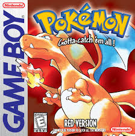
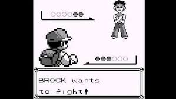
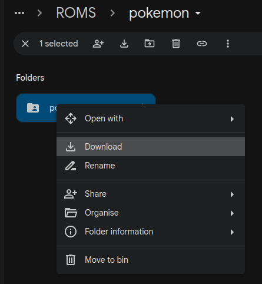
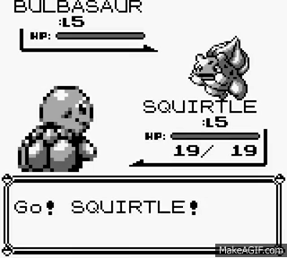
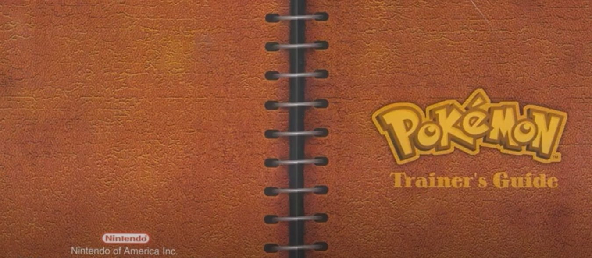
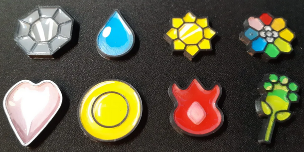
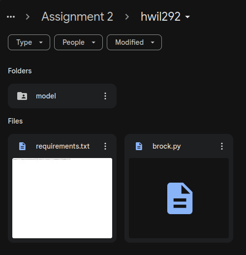

# Assignment Instructions
Base code and templates for doing COMPSYS726 Assignment 2 Pokemon Reinforcement Learning tasks. This document provides all the instructions to setup and complete the assignment.

## Pokemon
"Pokémon Red," released for the Game Boy in 1996, is one of the pioneering titles in the Pokémon series and played a crucial role in establishing the franchise's global popularity. Developed by Game Freak and published by Nintendo, the game introduces players to the fictional world of Kanto, where they assume the role of a young Pokémon Trainer on a quest to become the Pokémon Champion. Players must capture, train, and battle with a variety of Pokémon creatures, each possessing unique abilities and characteristics. The game's core mechanics of turn-based battles, exploration, and the goal of catching all 151 original Pokémon laid the foundation for future titles.

Additional Details: https://en.wikipedia.org/wiki/Pok%C3%A9mon_Red,_Blue,_and_Yellow 

<p align="center">
    
</p>

## Objective
The objective of this assignment is to implement your version of the "brock.py" task to enable a Reinforcement Learning (https://en.wikipedia.org/wiki/Reinforcement_learning) agent to learn to play the game of Pokemon Red from the original GameBoy. You are free to choose how you implement the environment, using any methodology or resources online that you wish.

The full game of Pokemon is ***immensely*** complicated to learn - this assignment will be limited to beating the first Pokemon Gym leader Brock. It should be noted that even beating Brock is a ***very difficult task***, and it is not expected that everyone (or anyone...) will achieve this goal. 

The core objective is to consider what information is required from the agent, and to get hands on experience using machine learning to solve a complex task. Your exploraiton into solving this problem will provide key insights into the material - which you will demonstrate in the report by explaining how you approached solving this complex task with reinforcement learning and what you experienced along the way.  

The full details of the assignment marking and expectations of the report are laid out on Canvas: TODO

<p align="center">
    
</p>

## Setup
Follow these steps carefully to pull the required libraries and packages to do this assignment. These instructions will default to using a folder called "~/compsys726" to manage the required packages but you may pull these packages into any directory you desire.

Please use **python3.10** for this assignment - this is the version we specifically use (**3.11** might work but no promises). We know this will **not work on python3.12** due to deprecated packages being removed. 

### Install Required Packages
This assignment requires three key packages to operate - you'll need to install them in a specific order as laid out below. 

#### 0: CUDA Acceleration (Nvidia GPU only)
If you want to utilise the GPU with Pytorch install CUDA first - https://developer.nvidia.com/cuda-toolkit

#### 1: cares_reinforcement_learning
The cares_reinforcement_learning package provides implementations of modern Reinforcement Learning algorithms and utlities for doing research. This package contains the reinforcement learning algorithms and implementations you can leverage to learn to play Pokemon. Further details can be explored here: https://github.com/UoA-CARES/cares_reinforcement_learning

```
mkdir ~/compsys726
cd ~/compsys726
git clone https://github.com/UoA-CARES/cares_reinforcement_learning.git
cd cares_reinforcement_learning
pip3 install -r requirements.txt
pip3 install --editable .
```

#### 2: compsys726_pokemon_agent (primary package)
This is the current package - it contains the requirements for implementing the Pokemon Environment for this project. All your work will be done in this specific package. This is explained in further details below. 

```
cd ~/compsys726
git clone https://github.com/UoA-CARES/compsys726_pokemon_agent.git
cd compsys726_pokemon_agent
pip3 install -r requirements.txt
pip3 install --editable .
```

#### 3: gymnasium_envrionments
We have created a standardised general purpose gym that wraps the most common simulated environments used in reinforcement learning into a single easy to use place. This package serves as an example of how to develop and setup new environments - perticularly for the robotic environments. This package utilises the algorithms implemented in the repository https://github.com/UoA-CARES/cares_reinforcement_learning/ and the Pokemon Environment you will implement here in compsys726_pokemon_agent. Additional information can found here: https://github.com/UoA-CARES/gymnasium_envrionments

This package is how you will run the training agent and test your Pokemon Environment. 

```
cd ~/compsys726
git clone https://github.com/UoA-CARES/gymnasium_envrionments.git 
cd gymnasium_envrionments
pip3 install -r requirements.txt
```

### Download ROM
Download the Pokemon ROM folder from the link below ***(University of Auckland emails only)***.

https://drive.google.com/drive/folders/1z1RC41uLxoY3JJobXxOy37Cv3BoPZukP 

<p align="center">
    <p align="center">
        
    </p>
</p>

We will then unzip and copy the downloaded files into a roms folder in the "~/cares_rl_configs" folder in the home directory.

```
mkdir ~/cares_rl_configs
cd ~/Downloads
unzip pokemon-*.zip
cp -r pokemon ~/cares_rl_configs
```

## Usage
This package provides the baseline code for the pyboy environments - you run these envrionments through gymnasium_envrionment.

`train.py` takes in hyperparameters that allow you to customise the training run enviromment – OpenAI or DMCS Environment - or RL algorithm. Use `python3 train.py -h` for help on what parameters are available for customisation.

An example is found below for running on an example of the openai environment with TD3 through console

```
cd ~/compsys726/gymnasium_envrionments/scripts
python train.py run --gym openai --task HalfCheetah-v4 TD3 --display 1
```

### Running Pokemon Task
To run the base Pokemon Environment that has a very simple implementation you need to run it through the ***gymnasium_envrionments*** package. The environments are not currently implemented as that is your job - but you will see the agent randomly exploring before trying to "learn" from a very limited reward function and action space. 

```
cd ~/compsys726/gymnasium_envrionments/scripts
python3 train.py run --gym pyboy --domain pokemon --task brock TD3
```

<p align="center">
    
</p>

### Viewing Training Results
The results of training the agents is saved into this folder: ***~/cares_rl_logs/*** by default. The structure of the results is saved as below.

The saved trained models contain the weights of your trained agent and will be uploaded as per the instructions below for the competition. 

```
├─ALGORITHM/ALGORITHM-TASK-YY_MM_DD:HH:MM:SS/
├─ SEED
|  ├─ env_config.py
|  ├─ alg_config.py
|  ├─ train_config.py
|  ├─ data
|  |  ├─ train.csv
|  |  ├─ eval.csv
|  ├─ figures
|  |  ├─ eval.png
|  |  ├─ train.png
|  ├─ models
|  |  ├─ model.pht
|  |  ├─ CHECKPOINT_N.pht
|  |  ├─ ...
|  ├─ videos
|  |  ├─ STEP.mp4
|  |  ├─ ...
├─ SEED...
├─ ...
```

# Implementing your Pokemon Environment
Your Pokemon Environment will be fully implemented in ***pyboy_environment/environments/pokemon/tasks/brock.py***. The goal is to determine a suitable state representation for an agent to learn from, a suitable set of actions, and a suitable reward function to enable the agent to learn to complete the task of beating the first gym leader Brock. 

## Task Brock (brock.py)
You are free to modify and expand the class inside of ***pyboy_environment/environments/pokemon/tasks/brock.py*** and add additional features/functions required to implement your environment. This is not best coding practice but it makes the lecturers lives easier.

Brock.py contains one class as an example of how to implement this project - PokemonBrock.

### PokemonBrock
The PokemonBrock class represents the Pokemon game environment for the task of beating Brock that extends the generic PokemonEnvironment and inherits all of its functions. 

You can build upon this class all you want to implement your Task of beating Brock - this class enables you to read the game state, and define the actions the Pokemon Trainer can take.

The key requirements are implementing the class functions below:

```
def _get_state(self) -> np.ndarray:
    # Implement your state retrieval logic here
    game_stats = self._generate_game_stats()
    return [game_stats["badges"]]

def _calculate_reward(self, new_state: dict) -> float:
    # Implement your reward calculation logic here
    return new_state["badges"] - self.prior_game_stats["badges"]

def _check_if_done(self, game_stats: dict[str, any]) -> bool:
    # Setting done to true if agent beats first gym (temporary)
    return game_stats["badges"] > self.prior_game_stats["badges"]

def _check_if_truncated(self, game_stats: dict) -> bool:
    # Implement your truncation check logic here

    # Maybe if we run out of pokeballs...? or a max step count
    return self.steps >= 1000
```

## Pokemon Red Manual
The link below provides the physical manual with instructions on how to play Pokemon Red. This information will be super useful for developing your environment. For those too young to remember physical manuals these used to come with the physical cartridge and you couldn't just Google how to play. 

https://pokemon-project.com/juegos/manual/manual-GB-Pokemon-Rojo-Azul-EN.pdf

<p align="center">
    
</p>

# Competition (Optional)
The class competition is a chance to earn ***bonus*** marks by potentially placing the top 10 furthest highest scoring agent.

Agents will be scored first based on the progression of the game - measured as beating Brock, capturing Pokemon, and leveling up/evolving pokemon over a maximum over 10,000 actions. 

Placement will be determined by the following scoring tiers:

* 1st Tier
    * Defeating Brock
    * Ties broken by Least amount of actions required
* 2nd Tier
    * Highest Number of Unique Pokemon Captured
    * Ties broken by the highest Number of Pokemon Seen
* 3rd Tier
    * Highest Average Level of Pokemon in Party
    * Ties broken by highest Average experience of Pokemon in Party

Ties within the three tiers will be given equal relative placement if required.

| **Placement** | **Bonus Marks** |
|---------------|-----------------|
| 1             | 5.0%            |
| 2             | 4.5%            |
| 3             | 4.0%            |
| 4             | 3.5%            |
| 5             | 3.0%            |
| 6             | 2.5%            |
| 7             | 2.0%            |
| 8             | 2.0%            |
| 9             | 1.5%            |
| 10            | 1.5%            |

The top placement will also win a neat Pokemon Badge!

<p align="center">
    
</p>

## Agent Submission Process
To submit your agent for the class Competition you need to upload your ***brock.py*** file, ***requirements.py***, and ***trained model files*** by following the steps below. No other files will be utilised - the code needs to be self sufficient within "brock.py" and all additional package requirements must be captured in the "requirements.txt".

### Step 1 - Create requirements.txt
You need to create a requirements.txt that contains all the python packages you are using for your expert agent.
This can easily be generated by running 'pipreqs' in the **root directory** of the package.

```
pip3 install pipreqs
cd ~/compsys726/compsys726_pokemon_agent
python3 -m pipreqs.pipreqs --force
```

This will regenerate the "requirements.txt" file with your specific packages and their versions. This will enable your agent to operate as expected. 

### Step 2 - Upload Files to Google Drive
Following this link: https://drive.google.com/drive/folders/1OWORBjdzuJjPZYZoCKMs4hI3xemvcDzh

Create a folder using your ***upi*** as the name. Copy your 'requirements.txt' and 'brock.py' files into the folder. These files can be updated as many times as you wish until the final deadline. It is imperative that the files maintain their names - ***brock.py*** and ***requirements.txt*** for the automted system to parse them correctly. 

Inside your ***upi*** folder create a folder called ***model***. Copy the trained agent model files (e.g. ***ALGORITHM_actor.pht*** and ***ALGORITHM_critic.pht***) you wish to run from ***~/cares_rl_logs/***.

This should look like the example below:

<p align="center">
    
</p>

## Competition Day
After the submission date the lecturers will run the automated competition offline - the results of the competition will be presented in class with the top 10 agents and their performance being shown.

If the automated system fails to run your code for any reason - it will be disqualified from placing. It is the students onus to make sure they follow the instructions properly to give them a chance at their agent placing in the competition. 
